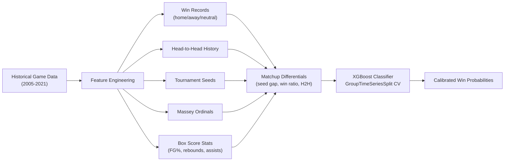

# March Machine Learning Mania 2021 — NCAA Tournament Prediction


## Overview

The [March Machine Learning Mania 2021](https://www.kaggle.com/competitions/ncaam-march-mania-2021) competition challenged participants to predict the outcomes of every possible matchup in the 2021 NCAA basketball tournament — both men's (NCAAM) and women's (NCAAW) brackets. For each potential game, the model outputs a calibrated win probability for Team 1. The task required predicting all 2,278 possible matchups (not just the 63 actual tournament games), making probability calibration critical.

Kaggle profile: [illidan7](https://www.kaggle.com/illidan7)

## Approach

### 1. Ordinal Ranking Baseline

Started with a simple baseline using Massey Ordinal rankings. Evaluated all 100+ ranking systems against historical tournament results, selected the POM (Pomeroy) system as the most predictive, and converted ordinal ranks into calibrated win probabilities using a logistic transform: `P(win) = 1 / (1 + 10^((RatingL - RatingW) / 15))`.

### 2. Feature Engineering (Stage 1)

Built 30+ features per team from compact historical game data (2005-2021):
- **Win records**: Cumulative and season-level win counts and ratios, segmented by venue (home, away, neutral court)
- **Head-to-head**: Pairwise matchup history between every team pair — win ratio, home win ratio, games played
- **Tournament seeds**: Prior year seed number as a proxy for team strength, with unseeded teams assigned a default value of 20
- **Massey ordinals**: Aggregated ordinal rankings (min, max, range, average) across ranking systems
- **Matchup differentials**: Pairwise comparison features — seed gap, win ratio ratio, experience ratio, H2H dominance

### 3. XGBoost with Temporal Cross-Validation (Stage 1)

Trained an XGBoost classifier on both regular season and tournament games. Used a custom `GroupTimeSeriesSplit` cross-validator that splits by season to prevent future data leakage — each fold trains on earlier seasons and validates on the next. Feature importance pruning removed low-signal columns after the first pass, then retrained on the reduced feature set. Best model selected by minimum validation log loss across folds.

### 4. Enhanced Feature Pipeline (Stage 2)

Expanded the feature set with detailed box score statistics:
- **Scoring**: Points scored, score differential, points per game
- **Shooting**: FG%, 3PT%, FT% (made, attempted, conversion rates)
- **Rebounding**: Offensive and defensive rebounds
- **Playmaking**: Assists, turnovers, steals, blocks, personal fouls
- **Ordinal pivoting**: Per-system ordinal rankings pivoted into individual features, then averaged across systems for robust composite rankings
- **Coach tenure**: Years of coaching experience at the team
- **Late-season neutral-court games** added to training data to better simulate tournament conditions

### 5. NCAAW Adaptation

Both the Stage 1 and Stage 2 pipelines were adapted for the women's tournament. The women's bracket has different dynamics — higher seed predictability, fewer historical seasons — but the same feature architecture and model pipeline were applied with independently tuned parameters.

## Results

| Stage | Features | Model | Notes |
|---|---|---|---|
| Baseline | Massey Ordinals | Logistic transform | POM system selected from 100+ rankings |
| Stage 1 | 30+ (win records, H2H, seeds) | XGBoost | GroupTimeSeriesSplit CV |
| **Stage 2** | **Box scores + ordinals + coach tenure** | **XGBoost (enhanced)** | Late-season neutral-court games added |

> Both NCAAM and NCAAW brackets predicted. Metric: Log Loss over 2,278 possible matchups.

## Architecture



## Repository Structure

```
├── baseline/                                    # Baseline Approach
│   └── ordinal-ranking-baseline.ipynb           # Massey Ordinals + POM rating system
├── ncaam/                                       # Men's Tournament (NCAAM)
│   ├── ncaam-stage1-xgboost.ipynb               # Stage 1: 30+ features + XGBoost (17 versions)
│   └── ncaam-stage2-ensemble.ipynb              # Stage 2: detailed stats + enhanced model (5 versions)
└── ncaaw/                                       # Women's Tournament (NCAAW)
    ├── ncaaw-stage1-xgboost.ipynb               # Stage 1: adapted pipeline for NCAAW
    └── ncaaw-stage2-ensemble.ipynb              # Stage 2: enhanced NCAAW model (3 versions)
```

## Tech Stack

- **ML**: XGBoost (primary classifier)
- **Data**: pandas, NumPy
- **Visualization**: Matplotlib, Seaborn
- **Validation**: GroupTimeSeriesSplit (custom temporal CV respecting season boundaries)
- **Infrastructure**: Kaggle Notebooks (CPU)

## Competition

| | |
|---|---|
| **Competition** | [NCAA March Machine Learning Mania 2021](https://www.kaggle.com/competitions/ncaam-march-mania-2021) |
| **Type** | Featured prediction (tabular, probability calibration) |
| **Metric** | Log Loss |
| **Timeline** | February -- April 2021 |
